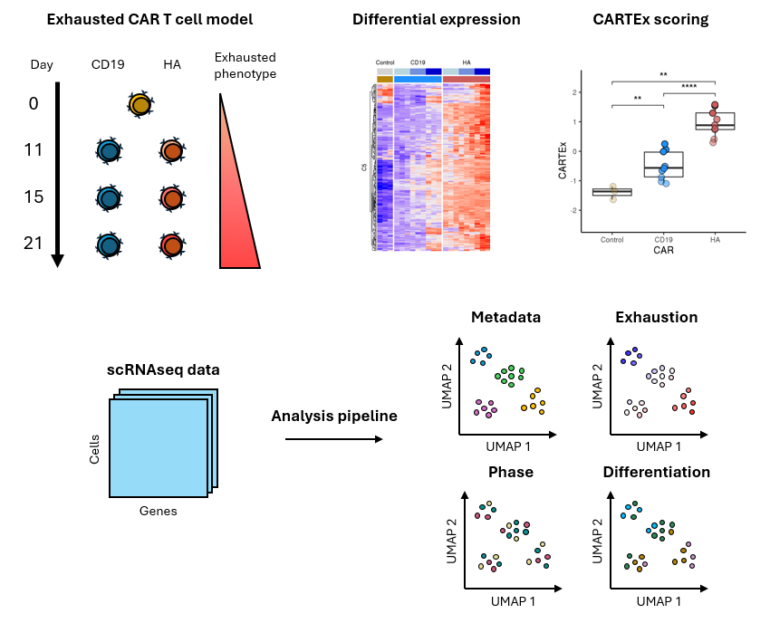
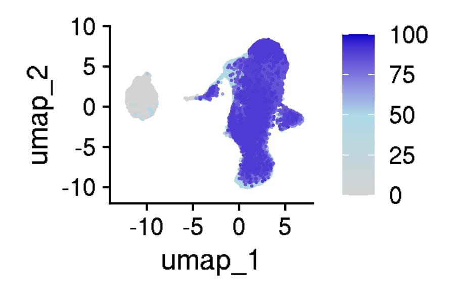
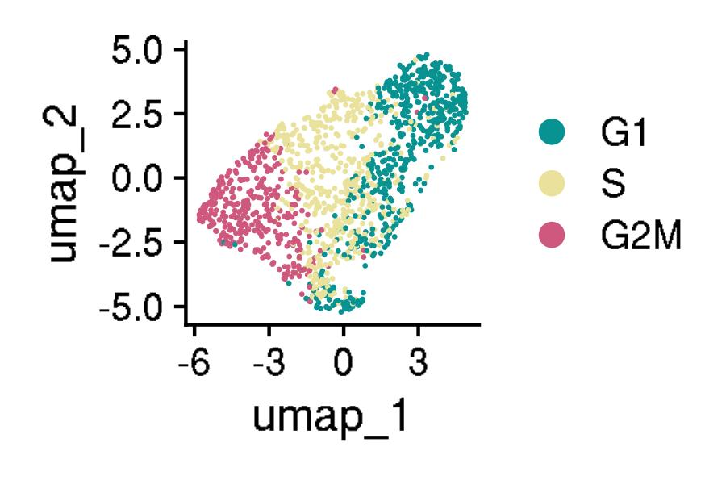

# CARTEx: CAR T cell exhaustion signature

This is the github repository for the CAR T cell exhaustion (CARTEx) signature project. Pre-processing and analyses were performed using [Seurat](https://satijalab.org/seurat/) and custom pipelines written in [R](https://www.r-project.org/). [Sherlock](https://www.sherlock.stanford.edu/docs/#welcome-to-sherlock), a high-performance computing (HPC) cluster at Stanford University, was used for computation and storage. The purpose of this research was to develop a robust signature and procedure for quantifying T cell exhaustion states. 

- [About](#about)
- [Experiments](#experiments)
  - [Datasets](#datasets)
  - [Utilities](#utilities)
  - [Analyses](#analyses)
    - [GSE136184](#gse136184)
    - [GSE125881](#gse125881)
- [Literature](#literature)
  - [Reviews](#reviews)
  - [Signatures](#signatures)
  - [Limitations](#limitations)

# About 

Historically, T cell exhaustion was described based on a few canonical markers. Recent advances in single-cell sequencing has enabled high-resolution of transcriptomics and deeper insights underpinning cellular behavior, but many groups still identified "exhausted" T cells based on simple correlations with canonical markers (e.g. "PDCD1 is highly expressed in this cluster of cells, so these may be exhausted"). Using a robust model of CAR T cell exhaustion, we created a transcriptional signature to quantify T cell exhaustion. This signature was derived from differentially expressed genes between highly functional CD19 CAR T cells, exhaustion-prone HA CAR T cells, and control T cells. The HA CAR spontaneously aggregates and induces tonic signaling, which has been validated and used as a robust model of exhaustion in numerous studies ([Long et al. 2015 Nature Medicine](https://pubmed.ncbi.nlm.nih.gov/25939063/), [Lynn et al. 2019 Nature](https://pubmed.ncbi.nlm.nih.gov/31802004/), [Gennert et al. 2021 PNAS](https://pubmed.ncbi.nlm.nih.gov/34285077/), [Weber et al. 2021 Science](https://pubmed.ncbi.nlm.nih.gov/33795428/), [Klysz et al. 2024 Cancer Cell](https://pubmed.ncbi.nlm.nih.gov/37162847/)).

Preprint: coming soon...

Publication: coming soon...

**Graphical Abstract**

# Experiments 

We derived the CARTEx signature from in-house experiments comparing highly functional CD19 CAR T cells, exhaustion-prone HA CAR T cells, and control T cells. The scripts for identifying the gene set and constructing the weights are shared within [construction](construction). We then applied the CARTEx signature to both in-house and publicly-available experiments. Note, we do not include the raw or processed data for these experiments in the github repository, as the file sizes are far too large. However, our scripts for preparing and exploring the datasets are shared in this repository within [experiments](experiments). Publicly-available experiments can be downloaded from the [Gene Expression Omnibus (GEO)](https://www.ncbi.nlm.nih.gov/geo/) or [Zenodo](https://zenodo.org/).

General procedure for scRNAseq analyses:

1. Prepared datasets
  - Constructed Seurat objects `expt.obj` (for each experiment), `aging.obj` from [GSE136184](https://www.ncbi.nlm.nih.gov/geo/query/acc.cgi?acc=GSE136184), and `ref.obj` from [GSE164378](https://www.ncbi.nlm.nih.gov/geo/query/acc.cgi?acc=GSE164378)
    - `expt.obj`: Extracted CD8+ T cells (e.g. `CD8A_expression > 0 & CD8B_expression > 0 & CD4_expression == 0`)
    - `aging.obj`: Extracted disparate aging CD8+ T cell samples for cross-experiment comparisons based on exhaustion scores of naive T cells from newborns and young adults and terminally exhausted T cells from elderly adults
    - `ref.obj`: Extracted CD8+ T cells in PMBCs for reference mapping
  - Modified pre-processing pipeline from [Seurat guided clustering tutorial](https://satijalab.org/seurat/articles/pbmc3k_tutorial)
    - Filtered cell quality (e.g. `subset(expt.obj, subset = nFeature_RNA > 200 & nFeature_RNA < 6000 & percent.mt < 10)`)
    - Normalized counts by log transformation
    - Identified highly variable features
    - Scaled data to prepare for dimensionality reduction
    - Performed principal components analysis (PCA), which is a linear dimensional reduction technique, and determine 'dimensionality' of the dataset
    - Clustered cells using k-nearest neighbors (KNN) with edges drawn between cells with similar gene expression patterns (i.e. euclidian distance in PCA space)
    - Performed non-linear dimensional reductions, including Uniform Manifold Approximation and Projection for Dimension Reduction (UMAP) and [`destiny`](https://www.bioconductor.org/packages/release/bioc/html/destiny.html) diffusion
  - Analyzed cell cycle phase using modified pipeline from [Seurat cell cycle tutorial](https://satijalab.org/seurat/articles/cell_cycle_vignette.html)
  - Annotated cell type differentiation using reference-based [SingleR](https://bioconductor.org/packages/release/bioc/html/SingleR.html)
  - Calculated cell state scores using Seurat [`AddModuleScore()`](https://www.rdocumentation.org/packages/Seurat/versions/4.3.0/topics/AddModuleScore)
  - Compute exhaustion using CARTEx scoring procedure
  - Visualized annotated cells in the context of different embeddings (PCA, UMAP, diffusion)
2. Integrated datasets
  - Integrated with reference-based reciprocal PCA using modified pipeline from [Seurat fast integration tutorial](https://satijalab.org/seurat/articles/integration_rpca.html) and [Seurat reference mapping tutorial](https://satijalab.org/seurat/articles/integration_mapping.html)
    - Increased strength of alignment (e.g. `k.anchor = 20`)
  - Calculated exhaustion signatures on query datasets, which consists of `expt.obj` and `aging.obj`, but not `ref.obj`
3. Pseudo-bulk datasets
  - Aggregated cells using [`AggregateExpression`](https://satijalab.org/seurat/reference/aggregateexpression) from [Seurat pseudo-bulk analysis tutorial](https://satijalab.org/seurat/articles/essential_commands.html#pseudobulk-analysis)
4. Calculated exhaustion signatures

## Datasets 

Below are the datasets that we explored, from which we selected a subset to do deeper analysis on. In all datasets, we filtered for CD8+ T cells. Gene counts and cell counts before and after quality control filters were recorded in [`summarize_expts.csv`](miscellaneous/summarize_expts.csv).

| Type | Identifier | Experiment | Study |
|:----:|:----------:|------------|-------|
| RNAseq | [GSE136891](https://www.ncbi.nlm.nih.gov/geo/query/acc.cgi?acc=GSE136891) | Healthy T cells driven to exhaustion with tonically signaling CAR | [Lynn et al. 2019 Nature](https://pubmed.ncbi.nlm.nih.gov/31802004/) |
| scRNAseq | [GSE136874](https://www.ncbi.nlm.nih.gov/geo/query/acc.cgi?acc=GSE136874) | Functional CD19 CAR T cells vs exhaustion-prone GD2 CAR T cells | [Lynn et al. 2019 Nature](https://pubmed.ncbi.nlm.nih.gov/31802004/) |
| scRNAseq | [GSE120575](https://www.ncbi.nlm.nih.gov/geo/query/acc.cgi?acc=GSE120575) | TILs from cancer patients after receiving immune checkpoint blockade | [Sade-Feldman et al. 2018 Cell](https://pubmed.ncbi.nlm.nih.gov/30388456/) |
| scRNAseq | [GSE235676](https://www.ncbi.nlm.nih.gov/geo/query/acc.cgi?acc=GSE235676) | TILs from cancer patients before receiving immune checkpoint blockade | [Mei et al. 2023 Nature Cancer](https://pubmed.ncbi.nlm.nih.gov/37460871/) |
| scRNAseq | [GSE125881](https://www.ncbi.nlm.nih.gov/geo/query/acc.cgi?acc=GSE125881) | CD19 CAR T cells from cancer patients across 16 weeks | [Sheih et al. 2020 Nature Communications](https://pubmed.ncbi.nlm.nih.gov/31924795/) |
| scRNAseq | [GSE151511](https://www.ncbi.nlm.nih.gov/geo/query/acc.cgi?acc=GSE151511) | CD19 CAR T cell infusion product from cancer patients | [Deng et al. 2020 Nature Medicine](https://pubmed.ncbi.nlm.nih.gov/33020644/) |
| scRNAseq | [GSE153931](https://www.ncbi.nlm.nih.gov/geo/query/acc.cgi?acc=GSE153931) | SARS-CoV-2 reactive T cells from COVID-19 patients | [Kusnadi et al. 2021 Science Immunology](https://pubmed.ncbi.nlm.nih.gov/33478949/) |
| scRNAseq | [GSE150728](https://www.ncbi.nlm.nih.gov/geo/query/acc.cgi?acc=GSE150728) | COVID-19 patient atlas comprised of human peripheral blood mononuclear cells (PBMCs) | [Wilk et al. 2020 Nature Medicine](https://pubmed.ncbi.nlm.nih.gov/32514174/) |
| scRNAseq | [GSE136184](https://www.ncbi.nlm.nih.gov/geo/query/acc.cgi?acc=GSE136184) | Aging CD8+ T cells from healthy donors across 9 decades | [Lu et al. 2022 Nature Communications](https://pubmed.ncbi.nlm.nih.gov/36050300/) |
| scRNAseq | [GSE207935](https://www.ncbi.nlm.nih.gov/geo/query/acc.cgi?acc=GSE207935) | T cells from patients with STAT3 gain-of-function syndrome | [Schmitt et al. 2022 JCI Insight](https://pubmed.ncbi.nlm.nih.gov/36136607/) |
| scRNAseq | [GSE212217](https://www.ncbi.nlm.nih.gov/geo/query/acc.cgi?acc=GSE212217) | T cells from cancer patients with mismatch-repair deficiency | [Chow et al. 2023 Cancer Discovery](https://www.ncbi.nlm.nih.gov/pmc/articles/PMC9905265/) |
| scRNAseq | [GSE164378](https://www.ncbi.nlm.nih.gov/geo/query/acc.cgi?acc=GSE164378) | Azimuth reference atlas comprised of human peripheral blood mononuclear cells (PBMCs) | [Hao et al. 2021 Cell](https://pubmed.ncbi.nlm.nih.gov/34062119/) |
| RNAseq | [GSE107011](https://www.ncbi.nlm.nih.gov/geo/query/acc.cgi?acc=GSE107011) | Monaco refererence atlas | [Monaco et al. 2019 Cell Reports](https://pubmed.ncbi.nlm.nih.gov/30726743/) |
| scRNAseq | [Zenodo 3993994](https://zenodo.org/record/3993994) | T cells from patients with Parkinson's disease | [Wang et al. 2021 Cell Discovery](https://pubmed.ncbi.nlm.nih.gov/34282123/) |
| scRNAseq | [GSE196606](https://www.ncbi.nlm.nih.gov/geo/query/acc.cgi?acc=GSE196606) | T cells from NBEAL2-deficient patients with thrombocytopenia | [Delage et al. 2023 Nature Communications](https://pubmed.ncbi.nlm.nih.gov/37349339/) |
| scRNAseq | [GSE146264](https://www.ncbi.nlm.nih.gov/geo/query/acc.cgi?acc=GSE146264) | CD8+ T cell from autoimmune patients with psoriasis | [Liu et al. 2021 Journal of Allergy and Clinical Immunology](https://pubmed.ncbi.nlm.nih.gov/33309739/) |
| scRNAseq | [mdanderson TCM](https://singlecell.mdanderson.org/TCM/) | Integrated atlas of T cells from numerous cancer types | [Chu et al. 2023 Nature Medicine](https://pubmed.ncbi.nlm.nih.gov/37248301/) |
| scRNAseq | [GSE168940](https://www.ncbi.nlm.nih.gov/geo/query/acc.cgi?acc=GSE168940) | Circulating CAR T cells in cancer patients | [Good et al. 2022 Nature Medicine](https://pubmed.ncbi.nlm.nih.gov/36097223/) |
| scRNAseq | [GSE160160](https://www.ncbi.nlm.nih.gov/geo/query/acc.cgi?acc=GSE160160) | Continuous antigen exposure in CAR T cells | [Good et al. 2021 Cell](https://pubmed.ncbi.nlm.nih.gov/34861191/) |
| RNAseq | [GSE221070](https://www.ncbi.nlm.nih.gov/geo/query/acc.cgi?acc=GSE221070) | Adapter CAR T cells over time | [Nixdorf et al. 2023 Leukemia](https://pubmed.ncbi.nlm.nih.gov/37106163/) |
| scRNAseq | [GSE261475](https://www.ncbi.nlm.nih.gov/geo/query/acc.cgi?acc=GSE261475) | Engineered CD47 CAR T cells | draft |
| scRNAseq | [GSE255850](https://www.ncbi.nlm.nih.gov/geo/query/acc.cgi?acc=GSE255850) | Phase 1 study of CAR T cells for glioma | [Brown et al. 2024 Nature Medicine](https://pubmed.ncbi.nlm.nih.gov/38454126/) |
| scRNAseq | [GSE139555](https://www.ncbi.nlm.nih.gov/geo/query/acc.cgi?acc=GSE139555) | Peripheral T cell and TILs | |
| scRNAseq | [GSE126030](https://www.ncbi.nlm.nih.gov/geo/query/acc.cgi?acc=GSE126030) | T cell activation | [Szabo et al. 2019 Nature Communications](https://pubmed.ncbi.nlm.nih.gov/31624246/) |
| scRNAseq | [GSE214231](https://www.ncbi.nlm.nih.gov/geo/query/acc.cgi?acc=GSE214231) | SpeedingCARs: engineering CAR T cells by signaling domain shuffling | [Castellanos-Rueda et al. 2022 Nature Communications](https://pubmed.ncbi.nlm.nih.gov/36323661/) |
| scRNAseq | [GSE179994](https://www.ncbi.nlm.nih.gov/geo/query/acc.cgi?acc=GSE179994) | PD-1 blockade in lung cancer patients | [Liu et al. 2022 Nature Cancer](https://pubmed.ncbi.nlm.nih.gov/35121991/) | 
| scRNAseq |[GSE237254](https://www.ncbi.nlm.nih.gov/geo/query/acc.cgi?acc=GSE237254) | T cells from Parkinson's patients | [Capelle et al. 2023 Nature Communications](https://pubmed.ncbi.nlm.nih.gov/37985656/) |

[More notes](REF.md)

## Utilities 

We built custom functions and archived these within [`cartex-utilities.R`](cartex-utilities.R). Some of the key functions included:
- `generate_figs()` to save figures in jpeg and pdf formats
- `integerize()` to round single-cell scores to nearest integer
- `ViolinPlotQC` to visualize quality control measures
- `DimPlotHighlightIdents()` to customize Seurat [`DimPlot()`](https://satijalab.org/seurat/reference/dimplot) for highlighting cells by identity group
- `BarPlotStackSplit()` to visualize data stratification by two identity groups
- `PercentageFeatureSetDetected()` to customize Seurat [`PercentageFeatureSet()`](https://satijalab.org/seurat/reference/percentagefeatureset) for computing the detectable genes from a given feature set
- `SignatureScore()` to score cells using a weighted signature
- `EntropyScore()` to build an entropy model based on [ROGUE](https://github.com/PaulingLiu/ROGUE)
- `PseudoBulkLabels()` to construct a metadata vector to assign cells according to pseudo-bulk samples
- `ScoreSubroutine()` to quickly recompute signature scores for CARTEx, cell states, other dysfunctions, etc.  

We installed and used several packages from the [Comprehensive R Archive Network (CRAN)](https://cran.r-project.org/web/packages/ggpubr/index.html) and [Bioconductor](https://bioconductor.org/), sourced in [`cartex-utilities.R`](cartex-utilities.R), including:
- [`Seurat`](https://cran.r-project.org/web/packages/Seurat/index.html): toolkit for single-cell RNA sequencing analysis
- [`SingleR`](https://bioconductor.org/packages/release/bioc/html/SingleR.html): toolkit for reference-based single-cell RNA sequencing annotation
- [`scuttle`](https://bioconductor.org/packages/release/bioc/html/scuttle.html): toolkit for single-cell RNA sequencing analysis
- [`clustree`](https://cran.r-project.org/web/packages/clustree/index.html): toolkit for inspecting clusterings across many resolutions
- [`ggpubr`](https://cran.r-project.org/web/packages/ggpubr/index.html): `ggplot2`-based custom visualization
- [`ggplotify`](https://cran.r-project.org/web/packages/ggplotify/index.html): render figures compatible with `grid` and `ggplot2` systems
- [`patchwork`](https://cran.r-project.org/web/packages/patchwork/index.html): `ggplot2`-based composition of multiple plots
- [`stringr`](https://cran.r-project.org/web/packages/stringr/index.html): toolkit for string operations
- [`dplyr`](https://cran.r-project.org/web/packages/dplyr/index.html): toolkit for dataframe operations
- [`data.table`](https://cran.r-project.org/web/packages/data.table/index.html): extension of `data.frame`
- [`EnhancedVolcano`](https://bioconductor.org/packages/release/bioc/html/EnhancedVolcano.html): toolkit for differential expression analysis visualization
- [`glmGamPoi`](https://bioconductor.org/packages/release/bioc/html/glmGamPoi.html): package for fitting Gamma-Poisson distribution to single-cell data
- [`destiny`](https://www.bioconductor.org/packages/release/bioc/html/destiny.html): package for embedding cells into diffusion maps 

We established path variables to enable ease of general use, in which files can be called through `paste(<PATH_NAME>, <FILE_NAME>, sep = '')`:
- `PATH_CARTEX`: absolute path to where the project directory resides
- `PATH_CELLANNOTATE`: relative path to [`cellannotate`](cellannotate)
- `PATH_EXPERIMENTS`: relative path to [`experiments`](experiments)
- `PATH_SIGNATURES`: relative path to [`signatures`](signatures)
- `PATH_WEIGHTS`: relative path to [`weights`](weights)

## Analyses 

We share some summarized analyses resulting from our custom pipelines. Select figures from [`experiments`](experiments) were reorganized and archived to [`miscellaneous`](miscellaneous) using bash script [`summarized-analyses.sh`](miscellaneous/summarized-analyses.sh).

### GSE136184 

The [GSE136184](https://www.ncbi.nlm.nih.gov/geo/query/acc.cgi?acc=GSE136184) experiment was the cross-sectional and longitudinal studies of CD8 T cells in humans spanning 9 decades of life. This dataset had 120,418 total cells, of which 39,937 were CD8+ T cells. After quality control, we analyzed 39,937 CD8+ T cells. The single-cell transcriptomes had 10,098 genes.

Working directory: [`GSE136184`](experiments/GSE136184)

### GSE125881 

The [GSE125881](https://www.ncbi.nlm.nih.gov/geo/query/acc.cgi?acc=GSE125881) experiment was the kinetic monitoring of CAR T cells in cancer patients across 16 weeks. This dataset had 62,167 total cells, of which 47,754 were CD8+ T cells. After quality control, we analyzed 47,045 CD8+ T cells. The single-cell transcriptomes had 20,107 genes.

Working directory: [`GSE125881`](experiments/GSE125881)
- [`GSE125881-1-prepare.R`](experiments/GSE125881/GSE125881-1-prepare.R)
- [`GSE125881-2-integrate.R`](experiments/GSE125881/GSE125881-2-integrate.R)

### GSE136874 

The [GSE136874](https://www.ncbi.nlm.nih.gov/geo/query/acc.cgi?acc=GSE136874) experiment was comparing highly functional CD19 and exhaustion-prone GD2 CAR T cells on day 10 of cell culture. This dataset had 1,530 total cells, all of which were CD8+ T cells. After quality control, we analyzed 1,397 CD8+ T cells. The single-cell transcriptomes had 14,563 genes.

Working directory: [`GSE136874`](experiments/GSE136874)
- [`GSE136874-1-prepare.R`](experiments/GSE136874/GSE136874-1-prepare.R)
- [`GSE136874-2-integrate.R`](experiments/GSE136874/GSE136874-2-integrate.R)

# Literature 

## Reviews 

[Pauken and Wherry 2015 Trends in Immunology](https://pubmed.ncbi.nlm.nih.gov/25797516/) discusses the involvement of T cell exhaustion in infection and cancer.

[Collier et al. 2021 Nature Immunology](https://pubmed.ncbi.nlm.nih.gov/34140679/) discusses the involvement of T cell exhaustion in autoimmune diseases.

## Signatures 

[Wherry et al. 2007](https://pubmed.ncbi.nlm.nih.gov/17950003/) describes CD8 T cell exhaustion based on chronic infection by lymphocytic choriomeningitis virus (LCMV).

[Good et al. 2021](https://pubmed.ncbi.nlm.nih.gov/34861191/) describes NK-like CAR T cell exhaustion based on continuous antigen exposure of mesothelin CAR T cells.

## Limitations of scRNAseq analysis 

[Andrews et al. 2021 Nature Protocols](https://www.nature.com/articles/s41596-020-00409-w) describes common challenges with processing scRNAseq datasets, including quality control, differential expression, etc.

[Murphy and Skene 2022 Nature Communications](https://pubmed.ncbi.nlm.nih.gov/36550119/) describes the use of pseudobulk aggregation to address biased inference, which arises from subsampling cells from the same donor (i.e. identical genetic backgrounds).

[Li et al. 2023 Frontiers](https://pubmed.ncbi.nlm.nih.gov/37255988/) describes that the gene representation in single-cell methods is biased due to library preparation. It is likely that genes with enriched poly(G) motifs at the 3' end are underdetected as a result of hairpin structure formation with poly(A) tails.

[Grabski et al. 2023 Nature Methods](https://www.nature.com/articles/s41592-023-01933-9) describes the challenges with clustering analysis in scRNAseq. The standard procedure with Seurat is to perform principial components analysis on log-transformed, normalize counts, compute Euclidean distances between top principal components for every pair of cells, identify nearest neighbors for each cell, assign a weight to every pair of cells, and define clusters in a way to maximize modularity. Such an approach does not evaluate the likelihood of over- or under-clustering, so there could be falsely discovered or undetected clusters. 

[Ahlmann-Eltze and Huber 2021 Bioinformatics](https://pubmed.ncbi.nlm.nih.gov/33295604/) describes the robust fitting of Gamma-Poisson distribution to single-cell data, which has frequent zero and small values due to sparse sampling.

[Zappia and Oshlack 2018 GigaScience](https://pubmed.ncbi.nlm.nih.gov/30010766/) describes clustering trees as a visualization of clusterings across many resolutions.

[Böhm et al. 2022 Journal of Machine Learning Research](https://dl.acm.org/doi/abs/10.5555/3586589.3586684) describes neighborhood embeddings across attraction-repulsion spectrum.

