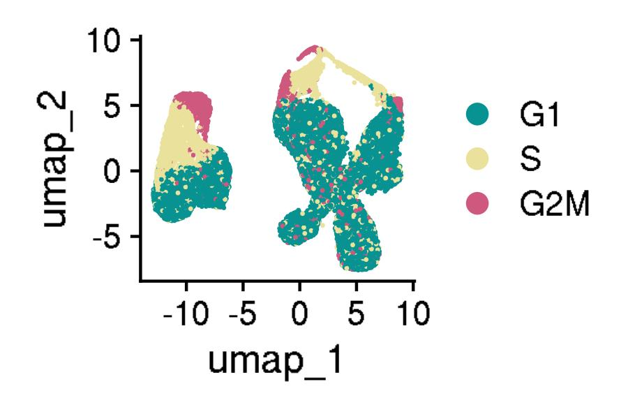

# CARTEx: CAR T cell exhaustion signature

This is the github repository for the CAR T cell exhaustion (CARTEx) signature project. Pre-processing and analyses were performed using [Seurat](https://satijalab.org/seurat/) and custom pipelines written in [R](https://www.r-project.org/). [Sherlock](https://www.sherlock.stanford.edu/docs/#welcome-to-sherlock), a high-performance computing (HPC) cluster at Stanford University, was used for computation and storage. The purpose of this research was to develop a robust signature and procedure for quantifying T cell exhaustion states. 

- [About](#about)
- [Experiments](#experiments)
  - [Datasets](#datasets)
  - [Utilities](#utilities)
  - [Analyses](#analyses)
- [Literature](#literature)
  - [Reviews](#reviews)
  - [Signatures](#signatures)

# About 

Historically, T cell exhaustion was described based on a few canonical markers. Recent advances in single-cell sequencing has enabled high-resolution of transcriptomics and deeper insights underpinning cellular behavior, but many groups still identified "exhausted" T cells based on simple correlations with canonical markers (e.g. "PDCD1 is highly expressed in this cluster of cells, so these may be exhausted"). Using a robust model of CAR T cell exhaustion, we created a transcriptional signature to quantify T cell exhaustion. This signature was derived from differentially expressed genes between highly functional CD19 CAR T cells, exhaustion-prone HA CAR T cells, and control T cells. The HA CAR spontaneously aggregates and causes tonic signaling, which has been validated as a robust model of exhaustion in numerous studies ([Long et al. 2015 Nature Medicine](https://pubmed.ncbi.nlm.nih.gov/25939063/), [Lynn et al. 2019 Nature](https://pubmed.ncbi.nlm.nih.gov/31802004/), [Gennert et al. 2021 PNAS](https://pubmed.ncbi.nlm.nih.gov/34285077/), [Weber et al. 2021 Science](https://pubmed.ncbi.nlm.nih.gov/33795428/)).

Preprint: coming soon...

Publication: coming soon...

# Experiments 

We derived the CARTEx signature from in-house experiments comparing highly functional CD19 CAR T cells, exhaustion-prone HA CAR T cells, and control T cells. We then applied the CARTEx signature to both in-house and publicly available experiments.

General procedure:

1. Prepared datasets
  - Constructed Seurat objects `expt.obj` (for each experiment), `aging.obj` from [GSE136184](https://www.ncbi.nlm.nih.gov/geo/query/acc.cgi?acc=GSE136184), and `ref.obj` from [GSE164378](https://www.ncbi.nlm.nih.gov/geo/query/acc.cgi?acc=GSE164378)
    - `expt.obj`: Extracted CD8+ T cells (e.g. `CD8A_expression > 0 & CD8B_expression > 0 & CD4_expression == 0`)
    - `aging.obj`: Extracted disparate aging CD8+ T cell samples for cross-experiment comparisons based on exhaustion scores of naive T cells from newborns and young adults and terminally exhausted T cells from elderly adults
    - `ref.obj`: Extracted CD8+ T cells in PMBCs for reference mapping
  - Filtered, normalized, scaled, performed dimensional reduction, cluster cells
    - Modified pre-processing pipeline from [Seurat guided clustering tutorial](https://satijalab.org/seurat/articles/pbmc3k_tutorial)
    - Filtered cell quality (e.g. `subset(expt.obj, subset = nFeature_RNA > 200 & nFeature_RNA < 6000 & percent.mt < 10)`)
  - Analyzed cell cycle phase using modified pipeline from [Seurat cell cycle tutorial](https://satijalab.org/seurat/articles/cell_cycle_vignette.html)
  - Annotated cell type using reference-based [SingleR](https://bioconductor.org/packages/release/bioc/html/SingleR.html)
  - Calculated cell state scores using Seurat [`AddModuleScore()`](https://www.rdocumentation.org/packages/Seurat/versions/4.3.0/topics/AddModuleScore)
2. Integrated datasets
  - Integrated with reference-based reciprocal PCA using modified pipeline from [Seurat fast integration tutorial](https://satijalab.org/seurat/articles/integration_rpca.html) and [Seurat reference mapping tutorial](https://satijalab.org/seurat/articles/integration_mapping.html)
    - Increased strength of alignment (e.g. `k.anchor = 20`)
  - Calculated exhaustion signatures on query datasets, which consists of `expt.obj` and `aging.obj`, but not `ref.obj`
3. Pseudo-bulk datasets
  - Aggregated cells using [`AggregateExpression`](https://satijalab.org/seurat/reference/aggregateexpression) from [Seurat pseudo-bulk analysis tutorial](https://satijalab.org/seurat/articles/essential_commands.html#pseudobulk-analysis)
4. Calculated exhaustion signatures

## Datasets 

| Identifier | Experiment | Study |
|:----------:|------------|-------|
| [GSE136874](https://www.ncbi.nlm.nih.gov/geo/query/acc.cgi?acc=GSE136874) | Functional CD19 CAR T cells vs exhaustion-prone GD2 CAR T cells | [Lynn et al. 2019 Nature](https://pubmed.ncbi.nlm.nih.gov/31802004/) |
| [GSE120575](https://www.ncbi.nlm.nih.gov/geo/query/acc.cgi?acc=GSE120575) | TILs from cancer patients after receiving immune checkpoint blockade | [Sade-Feldman et al. 2018 Cell](https://pubmed.ncbi.nlm.nih.gov/30388456/) |
| [GSE235676](https://www.ncbi.nlm.nih.gov/geo/query/acc.cgi?acc=GSE235676) | TILs from cancer patients before receiving immune checkpoint blockade | [Mei et al. 2023 Nature Cancer](https://pubmed.ncbi.nlm.nih.gov/37460871/) |
| [GSE125881](https://www.ncbi.nlm.nih.gov/geo/query/acc.cgi?acc=GSE125881) | CD19 CAR T cells from cancer patients across 16 weeks | [Sheih et al. 2020 Nature Communications](https://pubmed.ncbi.nlm.nih.gov/31924795/) |
| [GSE151511](https://www.ncbi.nlm.nih.gov/geo/query/acc.cgi?acc=GSE151511) | CD19 CAR T cell infusion product from cancer patients | [Deng et al. 2020 Nature Medicine](https://pubmed.ncbi.nlm.nih.gov/33020644/) |
| [GSE153931](https://www.ncbi.nlm.nih.gov/geo/query/acc.cgi?acc=GSE153931) | SARS-CoV-2 reactive T cells from COVID-19 patients | [Kusnadi et al. 2021 Science Immunology](https://pubmed.ncbi.nlm.nih.gov/33478949/) |
| [GSE136184](https://www.ncbi.nlm.nih.gov/geo/query/acc.cgi?acc=GSE136184) | Aging CD8 T cells from healthy donors across 9 decades | [Lu et al. 2022 Nature Communications](https://pubmed.ncbi.nlm.nih.gov/36050300/) |
| [GSE207935](https://www.ncbi.nlm.nih.gov/geo/query/acc.cgi?acc=GSE207935) | T cells from patients with STAT3 gain-of-function syndrome | [Schmitt et al. 2022 JCI Insight](https://pubmed.ncbi.nlm.nih.gov/36136607/) |
| [GSE212217](https://www.ncbi.nlm.nih.gov/geo/query/acc.cgi?acc=GSE212217) | T cells from cancer patients with mismatch-repair deficiency | [Chow et al. 2023 Cancer Discovery](https://www.ncbi.nlm.nih.gov/pmc/articles/PMC9905265/) |
| [GSE164378](https://www.ncbi.nlm.nih.gov/geo/query/acc.cgi?acc=GSE164378) | Azimuth reference atlas comprised of human peripheral blood mononuclear cells (PBMCs) | [Hao et al. 2021 Cell](https://pubmed.ncbi.nlm.nih.gov/34062119/) |
| [GSE107011](https://www.ncbi.nlm.nih.gov/geo/query/acc.cgi?acc=GSE107011) | Monaco refererence atlas | [Monaco et al. 2019 Cell Reports](https://pubmed.ncbi.nlm.nih.gov/30726743/) |
| [Zenodo 3993994](https://zenodo.org/record/3993994) | T cells from patients with Parkinson's disease | [Wang et al. 2021 Cell Discovery](https://www.nature.com/articles/s41421-021-00280-3) |

Note, we do not include the raw or processed data for these experiments, as the file sizes are far too large. However, our scripts for preparing and exploring the datasets are shared in this repository. Publicly-available experiments can be downloaded from the Gene Expression Omnibus (GEO).

[More notes](REF.md)

## Utilities 

We built custom functions and archived these within [`cartex-utilities.R`](cartex-utilities.R). Some of the key functions included:
- `generate_figs()` to save figures in jpeg and pdf formats
- `integerize()` to round single-cell scores to nearest integer
- `DimPlotHighlightIdents()` to customize Seurat [`DimPlot()`](https://satijalab.org/seurat/reference/dimplot) for highlighting cells by identity group

## Analyses 

We share some summarized analyses resulting from our custom pipelines. Select figures from [`experiments`](experiments) were reorganized and archived to [`miscellaneous`](miscellaneous) using bash script [`summarized-analyses.sh`](miscellaneous/summarized-analyses.sh).

### GSE125881

The [GSE125881](https://www.ncbi.nlm.nih.gov/geo/query/acc.cgi?acc=GSE125881) experiment was the kinetic monitoring of CAR T cells in cancer patients across 16 weeks. 

# Literature 

## Reviews 

[Pauken and Wherry 2015 Trends in Immunology](https://pubmed.ncbi.nlm.nih.gov/25797516/) discusses the involvement of T cell exhaustion in infection and cancer.

[Collier et al. 2021 Nature Immunology](https://pubmed.ncbi.nlm.nih.gov/34140679/) discusses the involvement of T cell exhaustion in autoimmune diseases.

## Signatures 

[Wherry et al. 2007](https://pubmed.ncbi.nlm.nih.gov/17950003/) describes CD8 T cell exhaustion based on chronic infection by lymphocytic choriomeningitis virus (LCMV).

[Good et al. 2021](https://pubmed.ncbi.nlm.nih.gov/34861191/) describes NK-like CAR T cell exhaustion based on continuous antigen exposure of mesothelin CAR T cells.

